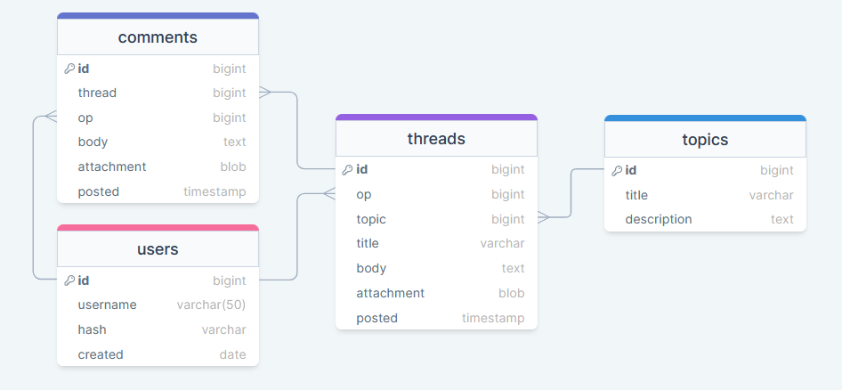

# Development of a Database-Driven Web Application for NCEA Level 3

Project Name: **PBS Forums**

Project Author: **Daniel Thomas**

Assessment Standards: **91902** and **91903**

-------------------------------------------------

## Design, Development and Testing Log

### 16/05/24

Planning the database in MySQL

I began working on planning the potential database using MySQL. This will be used as a framework for what the actual database may function like and look like, depicting it visually. I gave topics their own database instead of being a column under threads because this means admins could add new topics to the site through an admin menu instead of having to hardcode it in the HTML/CSS.

### DATE HERE

Replace this test with what you are working on

Replace this text with brief notes describing what you worked on, any decisions you made, any changes to designs, etc. Add screenshots / links to other media to illustrate your notes where necessary.

> Replace this text with any user feedback / comments

Replace this text with notes describing how you acted upon the user feedback: made changes to design, etc.

### DATE HERE

Replace this test with what you are working on

Replace this text with brief notes describing what you worked on, any decisions you made, any changes to designs, etc. Add screenshots / links to other media to illustrate your notes where necessary.

> Replace this text with any user feedback / comments

Replace this text with notes describing how you acted upon the user feedback: made changes to design, etc.

### DATE HERE

Replace this test with what you are working on

Replace this text with brief notes describing what you worked on, any decisions you made, any changes to designs, etc. Add screenshots / links to other media to illustrate your notes where necessary.

> Replace this text with any user feedback / comments

Replace this text with notes describing how you acted upon the user feedback: made changes to design, etc.

### DATE HERE

Replace this test with what you are working on

Replace this text with brief notes describing what you worked on, any decisions you made, any changes to designs, etc. Add screenshots / links to other media to illustrate your notes where necessary.

> Replace this text with any user feedback / comments

Replace this text with notes describing how you acted upon the user feedback: made changes to design, etc.

### DATE HERE

Replace this test with what you are working on

Replace this text with brief notes describing what you worked on, any decisions you made, any changes to designs, etc. Add screenshots / links to other media to illustrate your notes where necessary.

> Replace this text with any user feedback / comments

Replace this text with notes describing how you acted upon the user feedback: made changes to design, etc.
