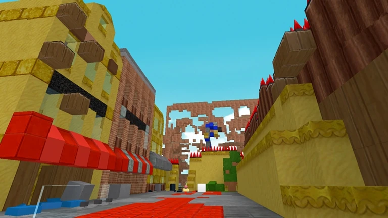

# PBS Forums

This is my Level 3 NCEA project for Digital Technologies

It is a database-driven web app that allows users to:

- Register an account
- Browse forum topics and threads
- Create threads and comments

## Documentation

The following documents support this project:

- [Design & Review](Design.md)
- [Development & Testing](Development.md)