# The Design of a Database-Driven Web Application for NCEA Level 3

Project Name: **PBS Forums**

Project Author: **Daniel Thomas**

Assessment Standards: **91902** and **91903**


-------------------------------------------------

## System Requirements

### Identified Need or Problem

Since the closure of the official ROBLOX forums and the fragmentation of the old ROBLOX community into various Discord servers, groups and isolated communities, there has been no centralized place to share progress, foster discussion or present discoveries regarding the past. Many, many different projects are buried in the depths of year-old Discord chats, never to see the light of day again.

The idea is that with a traditional web forum model, it will be easier to centralize specific discussions and directly work on problems with other users in a more professional and purpose-built manner.

### End-User Requirements

The user base will be those who have come to the website presumably already involved or interested in old ROBLOX history and or preservation. Many of these people will be programmers who are familiar with LuaU and could come from any background, however most of these people will be ages 14-25ish. Users will want the ability to open threads, share development updates and code, chat with other users and help each other with problems.

### Proposed Solution

I propose a standalone forum which aims to facilitate discussion, teamwork and unity where projects can find their own threads and tangents have a place to flourish.

Proposed features include:
- Account sign up, sign in and logout
- Account profile pages with user stats/info
- Account deletion system
- Secure account password hashing
- Special account permissions i.e. administrator
- Ability for administrators to remove threads/comments and ban users
- Forum topics (sections i.e. development, off-topic etc.) that can be created by administrators
- Forum threads that can be created by users with the ability to attach code excerpts/images and embed videos
- Thread comment system


-------------------------------------------------

## Relevant Implications

### Social Implications

The social implications of a website concern the impact the site has on its users, the wider community and society as a whole.

As a social platform, it is a responsibility that the website moderates and disproves of hateful behaviour, language and imagery and does not in any way offend or exclude based on gender, ethnicity, sexuality or religion etc. Users should be treated equally and hate should not be tolerated. Furthermore, the website should try to make a positive impact and foster community, belonging and kindness. 

As a website focused around a game largely played by younger age groups, talk of adult content and profanity should be kept to a minimum and reasonably punished/moderated. Moderators should not have any biases toward certain users and treat all situations with justification and equality. The website should have the necessary functionality for a working moderation system including the option to remove content and ban users.

### Aesthetic Implications

The aesthetic implications of a website relate to how it looks in terms of design.

It is necessary that the website looks presentable and visually interesting as to not put users off and make the website unenjoyable to use.

The site's aesthetics should match the subject matter somewhat and this includes retro web aesthetics and old ROBLOX iconography. However, the website's visuals should consider users of all walks of life such as visually impaired. Ultimately, aesthetics should not interfere or take precedence over the functionality of the website or make it any harder to use. This includes layout, fonts and color.

### Functionality Implications

The functionality implications of a website relate to how well it works for the end user, in terms of meeting its intended purpose.

Functionality is important to this website as it is any to ensure the user has a straight-forward experience when navigating and using the website. A non-functional website quickly turns users away and makes them not want to use it.

When programming the website, careful consideration and rigorous testing should take place to iron out potential bugs and issues which users could encounter. The website should absolutely not crash and everything should function as intended.

### Usability Implications

The usability implication of a website relate to the ease of use of the website without guidance or tutorial.

When designing the website, I should follow standard conventions for placement of buttons, menus etc. so that users are already familiar with how to navigate. There should always be a "way out" of pages either through the browser back button or a button on the site. It should always be obvious to the user what page they are on and what exactly they are doing on the site. Things should always be clear and familiar to the user and it should function like similar web forums (reddit etc.)

-------------------------------------------------

## Relevant User Experience (UX) Principles

### Visibility of System Status

The system should always keep users updated and informed about progress and what is going on with appropriate feedback and a reasonable amount of time.

Users wont want to be uninformed on the status of the various systems at work on the website especially since it is a site for live discussion with other users, meaning things will have to work at a fast pace to stimulate discussion and activity. If users are unaware of the progress of something or if it is even progressing, this runs the risk of users simply leaving the website out of frustration or misunderstanding. Furthermore, if the website doesn't accurately give feedback to the user on an interaction this may lead to confusion or frustration on the user's end when they don't understand what they have done incorrectly.

For example, the project may need to include progress bars/loading indicators for when things take time to upload/load, notification icons will need to tell you how many unread notifications the user has, timers which update users on the duration of bans and various other things that may include real-time progress. When forms are filled the site should respond timely with the status of their input (too many characters, invalid characters etc.).

### User Control and Freedom

The system should always allow users to undo or back out of actions to give them a sense of freedom.

User control is very important to this site since most of what users post will be publicly visible to anyone who accesses the website. Therefore, when users input something that they don't want published, the site should let them undo their actions to avoid the risk of posting something unwanted or frustrations around having to completely restart their action.

Users should be able to remove/undo parts of their posts without having to refresh the entire page, users should be able to delete their own posts etc.

### Help Users Recognize, Diagnose and Recover from Errors

Error messages should be expressed in plain language, precisely indicate the problem and constructively suggest a solution.

Throughout the site, users may encounter various errors and it is important that the error messages are serviceable as to not alienate or confuse them. 

When errors are encountered, the site should clearly display a pop-up or other obvious visual indicator that describes and highlights their error and offers the best solution for the user to resolve such error. This means not using error codes, 404 pages or other confusing dead ends. Errors should also try to retain as much progress as possible for the user so they don't end up having to rewrite things when they encounter an error.

### Match Between System and the Real-World

When designing the site, words and images should be familiar to the real world. For example, icons and such should use objects or familiar symbols from the real world so that users know what they mean. Language should be plain and direct instead of technical.

The site will likely have lots of icons which may want to use real icons to ease the user into understanding what they mean. The site may also need to speak directly to the end user, in which case language should not be technical but understandable to the average user.

### Error Prevention

The system should always do what it can do prevent users from creating errors. For example, there should be indicators to as whether a user's input is correct and there should always be confirmation messages for irreversable or major actions. Users also shouldn't be able to input incorrect data.

This is important to the site as it means users don't have to worry about causing errors themselves as the site will always give them a warning.

-------------------------------------------------

## Final System Design

### Database Structure


### User Interface Design


-------------------------------------------------

## Completed System

### Database Structure


### User Interface Design


-------------------------------------------------

## Review and Evaluation

### Meeting the Needs of the Users

I think I have successfully met the needs my users. I needed to create a place where formal and centralized discussions can take place and I believe that my forum site successfully allows users to do so by opening topics and leaving comments. I could have created more social options on the site like private messaging and such too though along with image embedding so that users could further communicate.

### Meeting the System Requirements

I think I fulfilled most of the original system requirements. However, there are a few things that I missed.

Proposed features included:
- Account sign up, sign in and logout

This was succesfully met with a functioning login, logout and signup system

- Account profile pages with user stats/info

This was successfully met as users can access both their own and other user's profiles, with the profiles showing their admin/moderator status, join date, topic count and comment count. The profiles also show customizable statuses and bio's with an accomodating edit profile poage.

- Account deletion system

I originally had an account deletion system set up where moderators could delete user accounts, but I ended up changing it to a ban system, where moderators can ban users (meaning their topics and comments still stay up but they cannot log into their accounts, their username shows up as "Banned User UserID", they don't show up on the user list and their profiles are inaccessible.) This means that all of the banned user data doesn't get erased and they can be freely unbanned at will.

- Secure account password hashing

Passwords are hashed and cannot be viewed even to admins with database access since the non-hashed passwords are never added to the database.

- Special account permissions i.e. administrator

Users with administrator permissions can access a special admin menu where they can set other administrators, set moderators and ban users. Users with administrator permissions can also delete topics and comments and also add new categories to the forum on the site. Administrators can also lock topics, meaning new comments can't be added, and pin topics meaning they show up at the top of the category. Similarly, users with moderator permissions can only delete topics, delete comments, pin posts and lock posts without the other powers of administrators.

- Ability for administrators to remove threads/comments and ban users

See above.

- Forum topics (sections i.e. development, off-topic etc.) that can be created by administrators

Administrators have the power to add new categories (which were previously called topics) on the site and can set a title and description.

- Forum threads that can be created by users with the ability to attach code excerpts/images and embed videos

Users can successfully create topics (previously called forum threads) however due to time constraints I didn't get around to adding embed / attach functionality to the new topic form.

- Thread comment system

Users can add comments to topics (previously called threads) at the bottom of the topic's page. Administrators can lock posts to not allow further comment.

There were also other planned features seen in the development document such as the search bar and notification bell which didn't make the final cut.

### Review of Social Implications

I addressed the social implications of the site in a multitude of ways.
- Problematic users can be banned from the website
- Harmful posts and comments can be removed from the website by administrators and moderators
- I created a rules post to outline what is and isn't allowed on the site

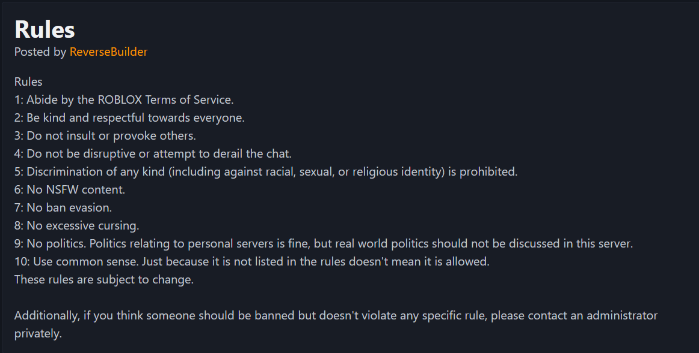

To further address the social implications, I could have:
- Added modmail for users to contact moderators
- Added a report button to report topics, comments and users
- Added an automatic filter for swear words and NSFW content
- Added a private message system between users for communication

### Review of Aesthetic Implications

To address the aesthetic implications of the site, I made sure I had a good color scheme which I produced with my end user with a focus on clarity. I also made sure my color scheme worked with switching from dark and light mode depending on what your browser is set to. I used a simplistic, bold font for readability. My design had a fairly clean and simple UI, not using any space for unnecessary clutter and keeping things streamlined and direct.

To keep a consistent aesthetic throughout the site, I made sure the layout of each page was at least somewhat consistent throughout. The headers were always in the same place and the content was always centered in the same place. This means the content was always in the same place when the user switches to a new page. Buttons across the site also had universal colors depending on function (grey = link, green = submit, red = delete) and all had the same styling. I used emojis for icons which gave them a consistent aesthetic across the site.


### Review of Functionality Implications

To address the functionality implications which I laid out for my website, rigorous bug testing and boundary testing took place both by me and my end users. I tested every system on the website. To ensure the code works properly on all browsers, I ran the code through an HTML, PHP and CSS validator.

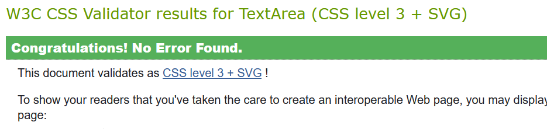
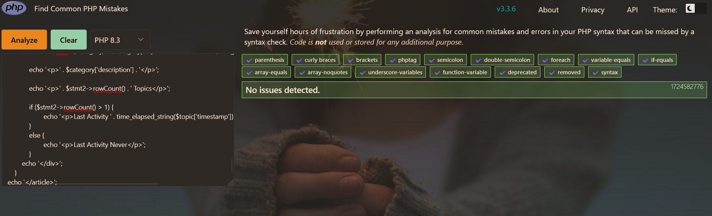
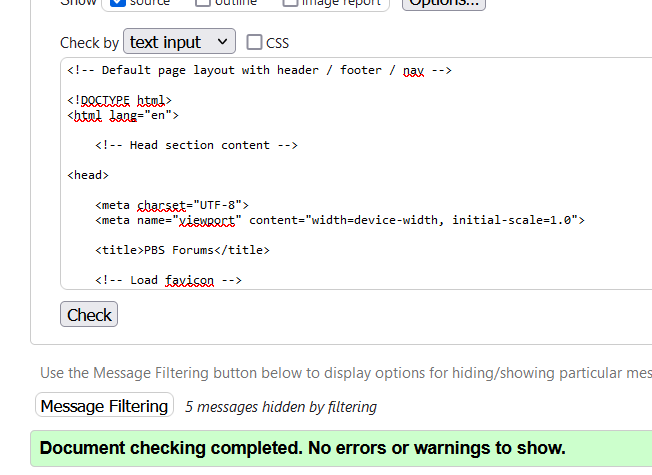

### Review of Usability Implications

To address the useability of the website, I made sure to have a clean and refined design. One way in which I did this was to always have the header clear at the top with links to all of the main pages of the site which is something familiar to a lot of other websites. This also means users can always back out of a page by using the navigation menu at the top or by going back on their browser. The design is also consistent throughout the website with the buttons being consistent and clear and hyperlinks all being highlighted orange so users know when they can click one to go to another page. The site always has a header at the top of the page so users know what page they are on too.

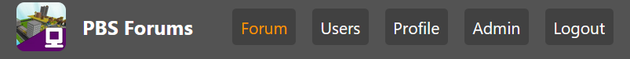

### Review of Visibility of System Status

I addressed the visibility of system status in various ways throughout the website. For example, if users try to go to various places to do certain actions, it is instead replaced with a message urging them to log in or sign up.
When they try to open a topic signed out:

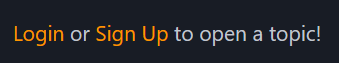

If users try to make a comment when they are signed out:

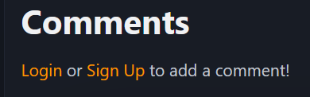

Alternatively, when users are logged in the site greets them with a message:


### Review of User Control and Freedom

To address user control, I always made sure users could back out of forms etc. Users can always use the browser back button to go back on pages and are never forced to fill in a form. Users can also always back out by clicking any links on the header. When editing their profile, I added a cancel button which means none of their changes will be saved:

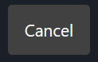

Furthermore, users have the ability to delete their own posts at will:

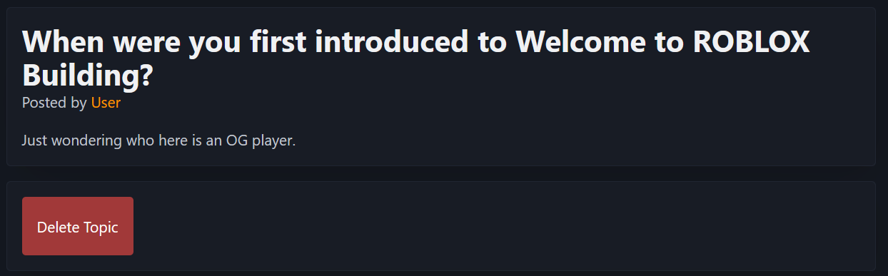

### Review of Help Users Recognize, Diagnose and Recover from Errors

When errors do inevitably occur on the website, I implemented various error codes and such to help users diagnose their issue. For example:

- When users input a username that doesn't exist on the login page:


- When users input a username that exists but get the password wrong on the login page:


- When users are creating an account and the username is too short:

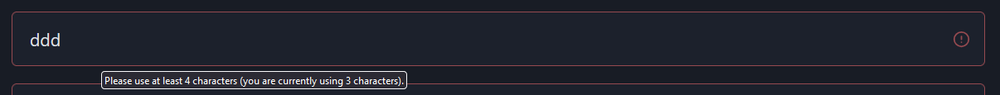

- When users are creating an account and the username is already taken:

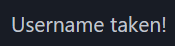

Furthermore, all of the forms have ```max-length``` set so that users are prevented from going over the boudary and a ```min-length``` so users go above the set boundary.

### Match Between System and the Real-World

To address the match between system and the real world, I used familiar language across the site (i.e. topics, comments etc) so that people would understand what I meant. I also used emoji icons across the site which correlated to real world objects that people can identify. For example, the pinned icon was a pin, the locked icon was a padlock and the administrator and moderator icons were shields.

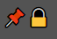


Furthermore, when displaying the last activity I didn't use a numerical date but instead clearly state to the user how long it has been since the last activity in seconds, minutes hours or days:

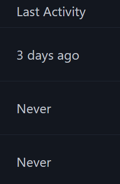

### Error Prevention

To prevent users from creating errors, I implemented a few systems. For example, whenever a major action is going to take place, the site has an ```hx-confirm``` message set:

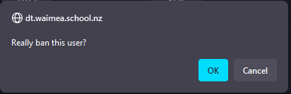
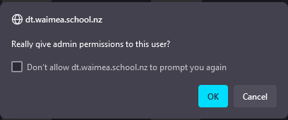

Furthermore, users cannot type in inputs or textareas for longer than the max length or shorter than the min length of whatever the input should be. This means users will not cause an error by inputting data that is either too short or too long for the database.