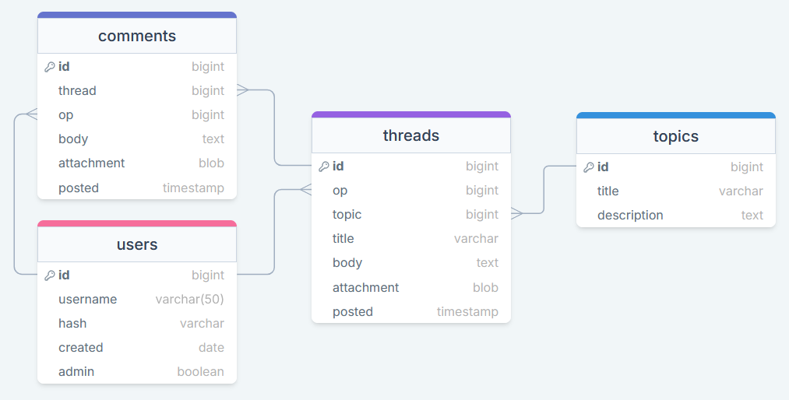
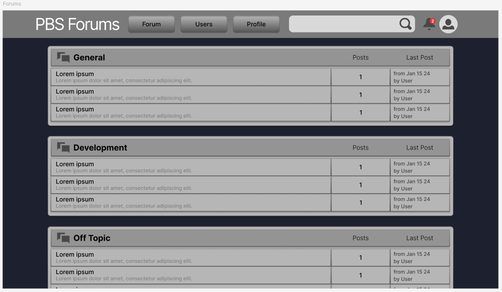
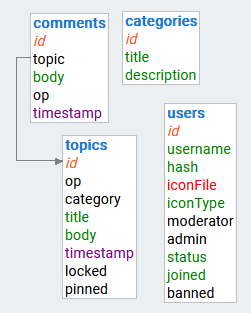
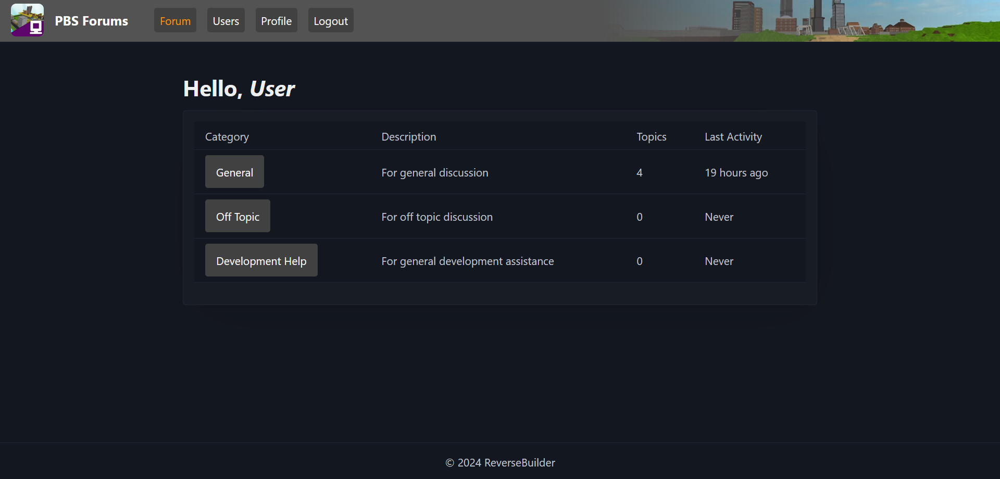

# The Design of a Database-Driven Web Application for NCEA Level 3

Project Name: **PBS Forums**

Project Author: **Daniel Thomas**

Assessment Standards: **91902** and **91903**

-------------------------------------------------

## System Requirements

### Identified Need or Problem

Since the closure of the official ROBLOX forums and the fragmentation of the old ROBLOX community into various Discord servers, groups and isolated communities, there has been no centralized place to share progress, foster discussion or present discoveries regarding the past. Many, many different projects are buried in the depths of year-old Discord chats, never to see the light of day again.

The idea is that with a traditional web forum model, it will be easier to centralize specific discussions and directly work on problems with other users in a more professional and purpose-built manner.

### End-User Requirements

The user base will be those who have come to the website presumably already involved or interested in old ROBLOX history and or preservation. Many of these people will be programmers who are familiar with LuaU and could come from any background, however most of these people will be ages 14-25ish. Users will want the ability to open threads, share development updates and code, chat with other users and help each other with problems.

### Proposed Solution

I propose a standalone forum which aims to facilitate discussion, teamwork and unity where projects can find their own threads and tangents have a place to flourish.

Proposed features include:
- Account sign up, sign in and logout
- Account profile pages with user stats/info
- Account deletion system
- Secure account password hashing
- Special account permissions i.e. administrator
- Ability for administrators to remove threads/comments and ban users
- Forum topics (sections i.e. development, off-topic etc.) that can be created by administrators
- Forum threads that can be created by users with the ability to attach code excerpts/images and embed videos
- Thread comment system

-------------------------------------------------

## Relevant Implications

### Social Implications

The social implications of a website concern the impact the site has on its users, the wider community and society as a whole.

As a social platform, it is a responsibility that the website moderates and disproves of hateful behaviour, language and imagery and does not in any way offend or exclude based on gender, ethnicity, sexuality or religion etc. Users should be treated equally and hate should not be tolerated. Furthermore, the website should try to make a positive impact and foster community, belonging and kindness. 

As a website focused around a game largely played by younger age groups, talk of adult content and profanity should be kept to a minimum and reasonably punished/moderated. Moderators should not have any biases toward certain users and treat all situations with justification and equality. The website should have the necessary functionality for a working moderation system including the option to remove content and ban users.

### Aesthetic Implications

The aesthetic implications of a website relate to how it looks in terms of design.

It is necessary that the website looks presentable and visually interesting as to not put users off and make the website unenjoyable to use.

The site's aesthetics should match the subject matter somewhat and this includes retro web aesthetics and old ROBLOX iconography. However, the website's visuals should consider users of all walks of life such as visually impaired. Ultimately, aesthetics should not interfere or take precedence over the functionality of the website or make it any harder to use. This includes layout, fonts and color.

### Functionality Implications

The functionality implications of a website relate to how well it works for the end user, in terms of meeting its intended purpose.

Functionality is important to this website as it is any to ensure the user has a straight-forward experience when navigating and using the website. A non-functional website quickly turns users away and makes them not want to use it.

When programming the website, careful consideration and rigorous testing should take place to iron out potential bugs and issues which users could encounter. The website should absolutely not crash and everything should function as intended.

### Usability Implications

-------------------------------------------------

## Relevant User Experience (UX) Principles

### Visibility of System Status

The system should always keep users updated and informed about progress and what is going on with appropriate feedback and a reasonable amount of time.

Users wont want to be uninformed on the status of the various systems at work on the website especially since it is a site for live discussion with other users, meaning things will have to work at a fast pace to stimulate discussion and activity. If users are unaware of the progress of something or if it is even progressing, this runs the risk of users simply leaving the website out of frustration or misunderstanding. Furthermore, if the website doesn't accurately give feedback to the user on an interaction this may lead to confusion or frustration on the user's end when they don't understand what they have done incorrectly.

For example, the project may need to include progress bars/loading indicators for when things take time to upload/load, notification icons will need to tell you how many unread notifications the user has, timers which update users on the duration of bans and various other things that may include real-time progress. When forms are filled the site should respond timely with the status of their input (too many characters, invalid characters etc.).

### User Control and Freedom

The system should always allow users to undo or back out of actions to give them a sense of freedom.

User control is very important to this site since most of what users post will be publicly visible to anyone who accesses the website. Therefore, when users input something that they don't want published, the site should let them undo their actions to avoid the risk of posting something unwanted or frustrations around having to completely restart their action.

Users should be able to remove/undo parts of their posts without having to refresh the entire page, users should be able to delete their own posts etc.

### Help Users Recognize, Diagnose and Recover from Errors

Error messages should be expressed in plain language, precisely indicate the problem and constructively suggest a solution.

Throughout the site, users may encounter various errors and it is important that the error messages are serviceable as to not alienate or confuse them. 

When errors are encountered, the site should clearly display a pop-up or other obvious visual indicator that describes and highlights their error and offers the best solution for the user to resolve such error. This means not using error codes, 404 pages or other confusing dead ends. Errors should also try to retain as much progress as possible for the user so they don't end up having to rewrite things when they encounter an error.

-------------------------------------------------

## Final System Design

### Database Structure

### User Interface Design

-------------------------------------------------

## Completed System

### Database Structure

### User Interface Design

-------------------------------------------------

## Review and Evaluation

### Meeting the Needs of the Users

Replace this text with a brief evaluation of how well you met the needs of your users. Look at what you initially wrote about who they are, what specific needs they have, etc. and discuss how well the system meets those needs.

### Meeting the System Requirements

Replace this text with a brief evaluation of how well you met the requirements that you defined at the start of the project, etc. Look back at the list of features / functionality you initially set and discuss how well your system has implemented each one.

### Review of IMPLICATION NAME HERE

Replace this text with brief notes showing how the implication was addressed in the final outcome. Accompany the notes with screenshots / other media to illustrate specific features.

### Review of IMPLICATION NAME HERE

Replace this text with brief notes showing how the implication was addressed in the final outcome. Accompany the notes with screenshots / other media to illustrate specific features.

### Review of IMPLICATION NAME HERE

Replace this text with brief notes showing how the implication was addressed in the final outcome. Accompany the notes with screenshots / other media to illustrate specific features.

### Review of UX PRINCIPLE NAME HERE

Replace this text with brief notes showing how the UX principle was addressed in the final outcome. Accompany the notes with screenshots / other media to illustrate specific features.

### Review of UX PRINCIPLE NAME HERE

Replace this text with brief notes showing how the UX principle was addressed in the final outcome. Accompany the notes with screenshots / other media to illustrate specific features.

### Review of UX PRINCIPLE NAME HERE

Replace this text with brief notes showing how the UX principle was addressed in the final outcome. Accompany the notes with screenshots / other media to illustrate specific features.
