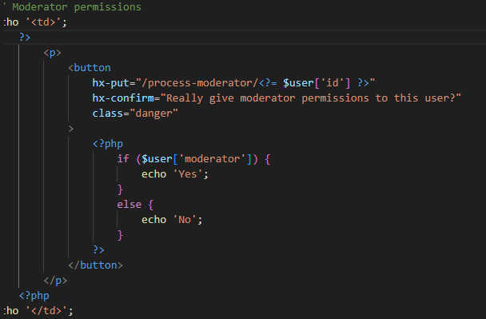

# Development of a Database-Driven Web Application for NCEA Level 3

Project Name: **PBS Forums**

Project Author: **Daniel Thomas**

Assessment Standards: **91902** and **91903**


-------------------------------------------------

## Design, Development and Testing Log

## 16/05/24


### **Planning the database in DrawSQL**

I began working on planning the potential database using DrawSQL. This will be used as a framework for what the actual database may function like and look like in MySQL clearly and concisely. I gave "forum topics" (sections i.e. general, off-topic) their own database instead of being a column under threads because this means admins could add new topics to the site through an admin menu, instead of having to hardcode it in the sites HTML/CSS.

The key functionality of the database would need to enable users to:
- Create new threads on the site when logged in
- Create comments to reply to those threads
- Create new accounts and log in/log out
- Allow admins to create new categories


## 17/05/24


### **Excalidraw flowchart prototype**

I started working on a flowchart in Excalidraw which illustrates how the website will flow and function on a base level.
The key functionalities I needed on the site were:
- A login/logout page
- A page for listing topics
- A page for listing threads
- Comment form
- Admin panel
- Profile page

Different shapes/colors represent different functions:
- The yellow circles represent where the user starts
- Blue squares are pages
- Purple diamonds are header buttons
- Red/green boxes are functional buttons.

I also responded to some end user feedback:


> A user suggested that the database be updated to include the admin permissions under "users"

The DrawSQL "users" database now includes an admin column which is a boolean.This now allows admins to toggle if users are admins/moderators


## 24/05/2024


### **Figma website design prototype**

I began to work on the prototype layout and flow of the website using the site Figma.

I decided to prioritize the mobile design first and then I would do the desktop design later. This design also doesn't have a color scheme so I stuck to greys since it would make it easier to apply color palettes later. I also used lorem ipsum text and placeholder images/icons to demonstrate where text/images would occur while not breaking the flow of the site. I wanted to use simple and clear fonts for easy readability and I tried to fill as much of the screen as possible to not create dead space and for an efficient design.

I intend to present this design to my end-user for refinements and improvements as well as potential ideas for a color scheme and desktop design.

## 31/05/2024

> 
> 
> 

### **Figma website design prototype 2**

After presenting the design to my end users, I recieved some feedback on the design.

They felt that the gradient made the UI look slightly outdated and that it should be up to modern design principles, so I toned down the gradient effect on the background and the header. They also felt that the buttons shouldn't be at the top from a user experience perspective, so I moved them down to the bottom.


### **Figma desktop design prototype**

I also began working on the desktop version of the design. I wanted a layout reminiscent of old web forums but with updated visuals and useability adhering to the useability heuristics. I created a table-like design for the forum category selection menu.


## 02/05/2024

I sent the new mobile design back to my end users who were overall happy with the design meaning I could move forward to doing the color palette.

> 

I then got some feedback for the desktop design and required a few little tweaks.

> 

I also began to work on a fewcolor palette for the site using RealtimeColors integrated into Figma:


### Color palette

I came up with this color palette and sent it to my end users. I selected these colors because the darker palette is easy on the eyes and the text is nice and contrasted to the dark background. Not to mention, the foreground elements stand out a lot compared to the background which helps with readability. The orange accent is for when buttons and such are hovered over and massively contrasts with the blue, as orange opposes blue on a color wheel.

The live preview of this design is on figma [here](https://www.figma.com/design/YNYFo6fAqYkV5rhpD3tLwF/Mobile-Iteration-1?node-id=0-1&t=WaUFJLY9HgXuoSTF-1)

I ran this pallete through a colour contrast checker to account for accessibility too:


## 03/05/2024

> 
> 
> 

I sent the color palette to my end users for feedback. They suggested to make it similar to Discord's color palette, which is a little more muted and maybe easier to read. They weren't a big fan of the shade of blue I used too.

I came up with a new color palette that's a little toned down:


The live preview of this design is on figma [here](https://www.figma.com/design/YNYFo6fAqYkV5rhpD3tLwF/Mobile-Iteration-1?node-id=0-1&t=WaUFJLY9HgXuoSTF-1)

I also updated the desktop design following the feedback I received:
- Changed the table inner corners to no longer be rounded
- Updated the gradient slightly


The live preview of this design is on figma [here](https://www.figma.com/design/mTuokHf0KFDsbr4ljA1Qsz/Desktop-Iteration-1?node-id=0-1&t=7YCcoBg3WWc1u0b8-1)

## 04/05/2024

I got some feedback on the new color palette:

> 
> 

And quickly applied these changes so I could finalize the color palette with my end users. I also sent back the desktop design so I could finalize that design.

## 05/05/2024

I got the feedback on the color palette and it needed a bit of tweaking on the navbar, which I quickly fixed. The color pallete was also going to slightly change based on if the users's browser is on light/dark mode, meaning if on light mode the black background would be a light grey.

> 

Here was my finalized mobile design after adjusting the shade of grey for contrast:


## 10/05/2024

I decided to move on from the  design stage and actually begun to create my functional website. First, I decided use MySQL to create the database which I refined with my end users on DrawSQL. This is where my website will be storing its data.


This ran into a few problems which my end users identified:
- The naming was confusing. I.e., threads should be called topics and topics should be called categories.
- The body and title didn't have proper limits.
- The database didn't have timestamps.

I worked through these problems by:
- Changing the naming conventions on the site.
- Giving the title a 128 character limit.
- Giving the body a 20,000 character limit (approx. 3000 words). Since it is a text and not varchar, I would have to make this limit when programming the create topic form.
- Creating a timestamp column with [CURRENT_TIMESTAMP] autoassigned.

## 5/06/2024

I finished a working prototype of the website which I allowed my end users to test. Here is some of the feedback they gathered for me:
- Profiles were a useless feature since they didn't display any information or offer any customization about the user.
- The website doesn't have a favicon
- It would be nice if admins could pin and lock posts
- The forms have no example text

## Bug testing

### Confirm messages
An issue which one of my end users found was that confirm messages would display the same message no matter what they were changing. For example,


This message would still display whether the user was toggling the other user as banned or unbanned.


This message would still display whether moderator permissions were being given or taken away.



I fixed this by moving the ```if else``` statement outside of the button and instead having 2 different buttons depending on the condition so that the ```hx-confirm=""``` message could be different


## System Testing

### Database Testing
I have extensively tested my database queries and have included proper error messages for when things go wrong on the user's end. Here are some videos of me testing my post forms, update forms and delete buttons.

- [Sign up form (POST)](https://mywaimeaschool-my.sharepoint.com/:v:/g/personal/dmthomas_waimea_school_nz/EfAzwsFNNMtBq3L6rP-En7EBVhb9pjVB85ezrkzTZPnHpg?e=HeexJX)

- [Add new category form (POST)](https://mywaimeaschool-my.sharepoint.com/:v:/g/personal/dmthomas_waimea_school_nz/EQkwE-fa0INKhKNbDApV2XUBadRdkd9Eqzfh3sbNd-8GLA?e=4FHh5b)
- [Edit profile (PUT)](https://mywaimeaschool-my.sharepoint.com/:v:/g/personal/dmthomas_waimea_school_nz/EQlMwD-SjSlOgvsCoaA3zvgBLgqC1wAeOR_odC_8w6KAdQ?e=DLeYgq&nav=eyJyZWZlcnJhbEluZm8iOnsicmVmZXJyYWxBcHAiOiJTdHJlYW1XZWJBcHAiLCJyZWZlcnJhbFZpZXciOiJTaGFyZURpYWxvZy1MaW5rIiwicmVmZXJyYWxBcHBQbGF0Zm9ybSI6IldlYiIsInJlZmVycmFsTW9kZSI6InZpZXcifX0%3D)
- [Admin menu (PUT)](https://mywaimeaschool-my.sharepoint.com/:v:/g/personal/dmthomas_waimea_school_nz/EVCKhL5a55FPi4XN4eVSzE0BTC1d2zdk68skdZjdL9KDiQ?e=p3zrrW&nav=eyJyZWZlcnJhbEluZm8iOnsicmVmZXJyYWxBcHAiOiJTdHJlYW1XZWJBcHAiLCJyZWZlcnJhbFZpZXciOiJTaGFyZURpYWxvZy1MaW5rIiwicmVmZXJyYWxBcHBQbGF0Zm9ybSI6IldlYiIsInJlZmVycmFsTW9kZSI6InZpZXcifX0%3D)
- [Delete post/comment (DELETE)](https://mywaimeaschool-my.sharepoint.com/:v:/g/personal/dmthomas_waimea_school_nz/EdNFlTgr-ddFk_V1QZkMc-oBwQKkcLXmciLeqpMoknGD8w?e=2n30Ep&nav=eyJyZWZlcnJhbEluZm8iOnsicmVmZXJyYWxBcHAiOiJTdHJlYW1XZWJBcHAiLCJyZWZlcnJhbFZpZXciOiJTaGFyZURpYWxvZy1MaW5rIiwicmVmZXJyYWxBcHBQbGF0Zm9ybSI6IldlYiIsInJlZmVycmFsTW9kZSI6InZpZXcifX0%3D)

### Functionality Testing